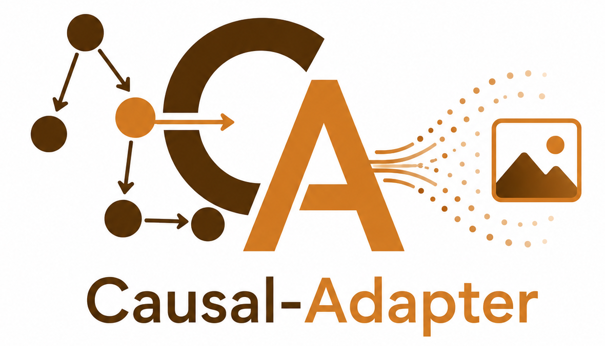
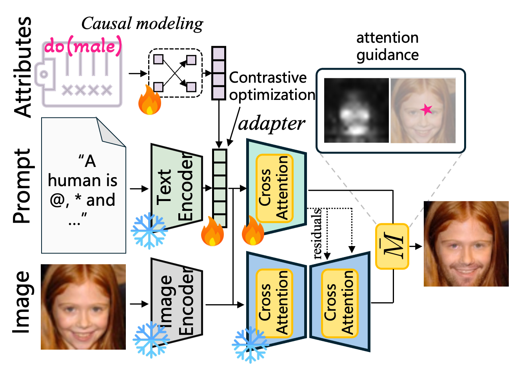

<p align="center">
  
</p>

<p align="center">
  <b>Taming Text-to-Image Diffusion for Faithful Counterfactual Generation</b>
  <br/>
  <em>ICML 2026</em>
</p>

<p align="center">
  <a href="https://openreview.net/forum?id=si8F5lk6Kg"></a>
  <a href="https://leitong02.github.io/causaladapter/"></a>
  <a href="https://arxiv.org/abs/2509.24798"></a>
  <a href="https://huggingface.co/LeiTong/Causal-Adapter"></a>
  <a href="#license"></a>
  
  
</p>

<p align="center">
  <a href="#news">News</a> ·
  <a href="#overview">Overview</a> ·
  <a href="#repository-structure">Structure</a> ·
  <a href="#installation">Installation</a> ·
  <a href="#workflow">Workflow</a> ·
  <a href="#training">Training</a> ·
  <a href="#inference">Inference</a> ·
  <a href="#gpu-memory">GPU Memory</a> ·
  <a href="#citation">Citation</a> ·
  <a href="#license">License</a>
</p>

---

## News

- ✅ **2026-06-02** — Released pretrained weights (Causal-Adapters, SCMs) on [`LeiTong/Causal-Adapter`](https://huggingface.co/LeiTong/Causal-Adapter) 🚀🚀🚀.
- ✅ **2026-06-02** — Open-sourced the benchmark / evaluation pipeline under `counterfactual-benchmark/` (Effectiveness / Composition / Reverse / FID).
- ✅ **2026-06-01** — SD1.5 and SD3 codebases unified into a single project root with a shared `diffusers/` fork (0.36.0.dev0).
- ✅ **2026-05-29** — SD1.5: shipped reproducible counterfactual inference notebooks (Pendulum / CelebA / ADNI) sharing a common `inference_utils.py`.
- ✅ **2026-05-28** — Open-sourced Causal-Adapter training code across Pendulum, ADNI, and CelebA 🚀🚀🚀.
- ✅ **2026-05-01** — [Causal-Adapter](https://icml.cc/virtual/2026/poster/61202) accepted as a poster at **ICML 2026** 🔥🔥.

## Overview

Causal-Adapter equips text-to-image diffusion models with an SCM head, a
lightweight causal ControlNet head, and a small set of pseudo-token embeddings,
enabling faithful counterfactual generation under interventions on causal
attributes. This repository hosts the official reference implementation for both
the Stable Diffusion v1.5 and Stable Diffusion 3 backbones, together with the
benchmark used for evaluation.

<p align="center">
  
</p>

## Repository Structure

SD1.5 and SD3 share a single project layout and a single `diffusers/` install:

| Path | Purpose |
| --- | --- |
| `train.py` | SD1.5 training entrypoint. |
| `train_SD3.py` | SD3 training entrypoint. |
| `causal_datasets/` | Dataset adapters (CelebA / CelebA-HQ / ADNI / MorphoMNIST / Pendulum / …) — shared by both backbones. |
| `causal_modules/` | Causal ControlNet heads, DDIM/Flow modules (`ddim_modules.py`, `ddim_modules_sd3.py`, `ddim_modules_flux.py`), SCM pretraining, and `p2p_edits/`. |
| `SCM_modeling/` | Causal discovery (DAGMA / NoTEARS / SDCD) and SCM training. |
| `notebook_benchmarks/` | Counterfactual inference notebooks (Pendulum / CelebA / ADNI / SD3 CelebA-HQ) sharing `inference_utils.py`. |
| `diffusers/` | Project fork of `diffusers` (0.36.0.dev0) exporting `Causal_ControlNetModel` (SD1.5) and `Causal_SD3ControlNetModel` (SD3). |
| `counterfactual-benchmark/` | Benchmark and evaluation pipeline. |
| `scripts/` | Shell wrappers — `scripts/adapter_training/*.sh` (Causal-Adapter training) and `scripts/scm_training/*.sh` (SCM pretraining + causal discovery). |
| `environment.yml` | Pinned conda environment (PyTorch 2.4.1 / CUDA 12.1 / diffusers 0.36 / transformers 4.46). |
| `pendulum.py` | Pendulum synthetic data generation script. |

## Installation

```bash
conda env create -f environment.yml
conda activate causal-adapter
pip install -e diffusers
```

`environment.yml` is pinned to the versions actually exercised on the
cluster (PyTorch 2.4.1 + CUDA 12.1 + diffusers 0.36 + transformers 4.46);
the editable `diffusers` install above is what `train.py` / `train_SD3.py`
load at runtime.

Make sure the project root is on `PYTHONPATH` so the patched
`Causal_ControlNetModel` can lazily import
`causal_modules.scm_pretraining.load_dataset_model`.

## Workflow

1. **Prepare or download a dataset** for your target domain. See the loaders
   under `causal_datasets/` for the expected on-disk layout.
2. **Prepare a pretrained backbone** — either a local SD / miniSD / SD3 folder
   (recommended behind a firewall) or a HuggingFace model id.
3. **Train or load an SCM** with the scripts under `SCM_modeling/`. The
   training scripts consume the resulting checkpoint via `--scm_path`.
4. **Run Causal-Adapter / MCPL training** with `train.py` (SD1.5) or
   `train_SD3.py` (SD3).
5. **Run inference** with the notebooks under `notebook_benchmarks/`.

## Training

### Required paths

| Argument | Required | What it points at |
| --- | --- | --- |
| `--pretrained_model_name_or_path` | yes | HuggingFace model id (e.g. `lambdalabs/miniSD-diffusers`, `stabilityai/stable-diffusion-3-medium-diffusers`) **or** a local snapshot folder. |
| `--train_data_dir` | yes | Dataset root. Layout depends on `--dataset`. |
| `--scm_path` | optional | Pretrained SCM checkpoint produced by `SCM_modeling/`. Optional during training; required at inference time for causal editing. |

### Shell scripts

Edit the `<set me>` placeholders at the top of each script and run from
the repo root:

```bash
# SCM training 
bash scripts/scm_training/train_scm_pendulum.sh

# SD1.5
bash scripts/adapter_training/train_pendulum.sh

# SD3 (uses accelerate + bf16)
bash scripts/adapter_training/train_sd3_celebahq.sh
```

See [`scripts/README.md`](./scripts/README.md) for the script index and
the recommended SCM-then-Causal-Adapter sequence.

### Important defaults

| Flag | Default | Notes |
| --- | --- | --- |
| `--mcpl_training` | `True` | Trains the pseudo-token embeddings. |
| `--causal_training` | `False` | When `False`, SCM head is frozen — pass `--scm_path`. |
| `--scm_path` | `None` | May be omitted during training; pass it at inference time for causal editing. |
| `--task_cond` | `generation_text_global_after` | Where the causal vector is injected. All tested runs use this. |
| `--mixed_precision` | `no` (SD1.5) / `bf16` (SD3) | Override to halve activation memory. |

Run `python train.py --help` or `python train_SD3.py --help` for the full surface.

## Inference

Once you have a trained run (a `controlnet-steps-*.safetensors` plus matching
`learned_embeds-*.safetensors`, optionally an SCM checkpoint), the notebooks
under `notebook_benchmarks/` reproduce the inversion / intervention /
attention-map figures used in the paper.

| Notebook | Backbone | Dataset | Base model | Pretrained Causal-Adapter |
| --- | --- | --- | --- | --- |
| `counterfactuals_pendulum.ipynb` | SD1.5 | Pendulum | [🤗 miniSD-diffusers](https://huggingface.co/lambdalabs/miniSD-diffusers) | [🤗 pendulum](https://huggingface.co/LeiTong/Causal-Adapter/tree/pendulum) |
| `counterfactuals_celeba.ipynb` | SD1.5 | CelebA (complex) | [🤗 miniSD-diffusers](https://huggingface.co/lambdalabs/miniSD-diffusers) | [🤗 celeba](https://huggingface.co/LeiTong/Causal-Adapter/tree/celeba) |
| `counterfactuals_ADNI.ipynb` | SD1.5 | ADNI | [🤗 miniSD-diffusers](https://huggingface.co/lambdalabs/miniSD-diffusers) | [🤗 ADNI](https://huggingface.co/LeiTong/Causal-Adapter/tree/ADNI) |
| `counterfactuals_celebahq_SD3.ipynb` | SD3 | CelebA-HQ (simple) | [🤗 stable-diffusion-3](https://huggingface.co/stabilityai/stable-diffusion-3-medium-diffusers) | [🤗 celebhq_sd3](https://huggingface.co/LeiTong/Causal-Adapter/tree/celebhq_sd3) |


Each notebook starts with a configuration cell. The example below shows the main
paths required to run the CelebA counterfactual generation notebook:

```python
import os

# 1) Frozen SD1.5 backbone, e.g. "lambdalabs/miniSD-diffusers".
BASE_MODEL_PATH = ""

# 2) Causal-Adapter ControlNet checkpoint and the matching MCPL learned pseudo-tokens.
#    Example ControlNet checkpoint:
#    https://huggingface.co/LeiTong/Causal-Adapter/blob/main/celeba/controlnet/controlnet-steps-200000.safetensors
CONTROLNET_PATH = ""

#    Example learned text embeddings:
#    https://huggingface.co/LeiTong/Causal-Adapter/blob/main/celeba/controlnet/learned_embeds-steps-200000.safetensors
TEXT_EMBEDDING_PATH = ""

# 3) Optional pretrained SCM head from SCM_modeling/.
#    Example SCM checkpoint:
#    https://huggingface.co/LeiTong/Causal-Adapter/blob/main/celeba/scm/best_model.pt
SCM_PATH = ""

# 4) CelebA root expected by torchvision.datasets.CelebA(root=...).
DATA_ROOT = os.environ.get("DATA_ROOT", "")

DATASET = "celeA_complex"
SIZE = 256
```

## GPU Memory

Approximate guidance against the tested commands. Real usage depends on
batch size, resolution, mixed precision, gradient checkpointing, and which
loss terms are enabled — profile your own setup.

| Backbone | Resolution | Batch size | Precision | Train | Inference |
| --- | --- | --- | --- | --- | --- |
| SD1.5 | 256 | 2 | fp32 | ~16 GB | ~6.2 GB |
| SD3 | 512 | 2 | bf16 | ~36 GB | ~21 GB |

To shrink the footprint:

- `--mixed_precision fp16` (or `bf16`).
- `--gradient_checkpointing` — trades compute for activation memory.
- Lower `--train_batch_size` and raise `--gradient_accumulation_steps`.
- Disable contrastive training with `--presudo_words_infonce ""` if the
  InfoNCE term is not needed.


## Citation

If you find this work useful, please cite our paper:

```bibtex
@inproceedings{tong2026causaladapter,
  title     = {Causal-Adapter: Taming Text-to-Image Diffusion for Faithful Counterfactual Generation},
  author    = {Tong, Lei and Liu, Zhihua and Lu, Chaochao and Oglic, Dino and Diethe, Tom and Teare, Philip and Tsaftaris, Sotirios A. and Jin, Chen},
  booktitle = {Proceedings of the Forty-third International Conference on Machine Learning},
  year      = {2026},
  url       = {https://openreview.net/forum?id=si8F5lk6Kg},
  note      = {arXiv:2509.24798}
}
```

## License

Our original code is released under **Apache 2.0** (`Copyright AstraZeneca UK
Ltd. or its affiliates`). Third-party code — including
[`diffusers`](https://github.com/huggingface/diffusers),
[prompt-to-prompt](https://github.com/google/prompt-to-prompt),
[counterfactual-benchmark](https://github.com/gulnazaki/counterfactual-benchmark),
and the DCDI / NOTEARS / DAGMA implementations — keeps its original license and
copyright header.
